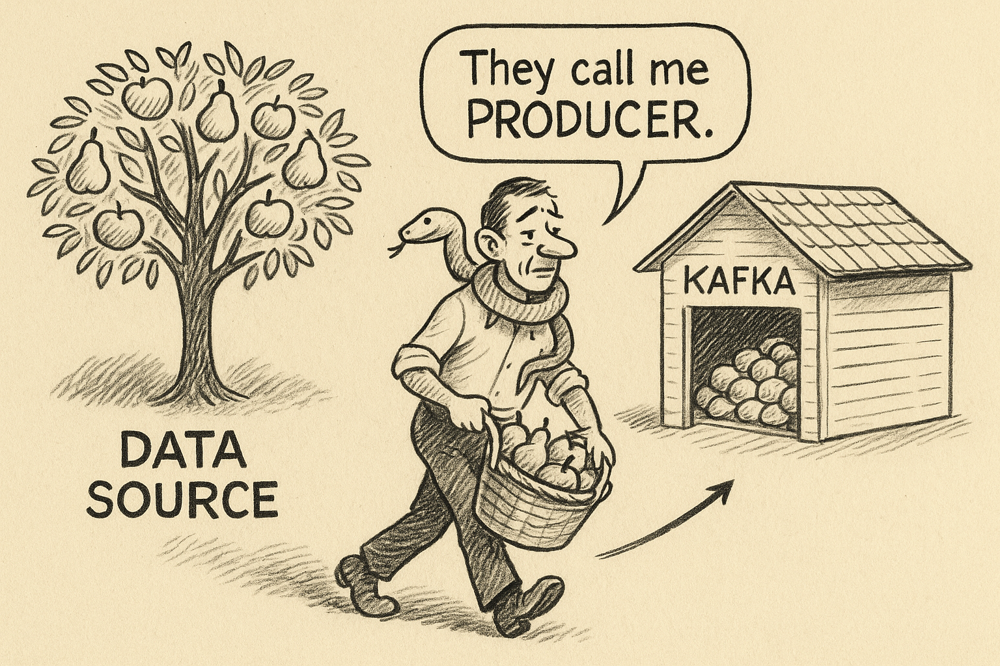

# Apache Kafka: What is it?

You've heard the name. Kafka powers Netflix, Uber, LinkedIn, basically every tech company handling serious data. 

So what is it? To make it simple, kafka is log-storage. Just like we have SQL databse to store tables.

But, its not just a simple log storage. Imagine  LinkedIn processes over a trillion events daily. Clicks, messages, updates, connections. That's not millions. That's *trillions*.

How do you create a system which will store so much of logs, in correct order and let consumers consume it?

Before Kafka, companies had two terrible options:

**Option 1:** Wire systems together directly. System A talks to System B, B talks to C, C talks to D. Works fine until you have 20 systems and a tangled mess of connections. Adding one new service means rewiring everything.

**Option 2:** Build custom messaging systems. Every team creates their own queue. Now instead of one mess, you have ten incompatible messes.

Neither scales. Neither works.

Kafka solved this by becoming the single source of truth for data movement. One system. Built to handle massive scale.

## What Kafka Actually Is

The official definition: "A distributed event streaming platform."

The real definition: **Kafka is a append-only log that stores data streams.**

Think of it like this:
- Producers write data into Kafka
- Kafka stores that data durably 
- Consumers read the data whenever they want

The key difference from a regular message queue? Kafka doesn't delete messages after they're read. It keeps them. You can read the same message ten times, or come back tomorrow and replay everything from the beginning.

It's more like a database log than a postal service.

## The Core Concepts

**Producer** - Writes data to Kafka  
**Consumer** - Reads data from Kafka  
**Topic** - A category or feed name (like "user-clicks" or "payment-events")  
**Partition** - Topics split into partitions for parallel processing  
**Broker** - A Kafka server (you run multiple for redundancy)  
**Consumer Group** - Multiple consumers sharing the work of reading a topic  
**Offset** - The position of a message in a partition  
**Replication** - Copies of data across brokers so nothing gets lost  

That's it. Master these and you understand Kafka.

## What Is a Producer?

A producer is any application or script that sends data into Kafka. It's code you write. Now, you may get confused by thinking Twitter, weather channels, cryto price sites are producers.They are data sources and not *producers*. But, actually they are not Producers as they don't write these data to your Kafka.The producer is actually the code you write to fetch data from these sites and write to your kafka. The one who has the access to your system.



**Example 1: Python script tracking crypto prices**

```python
from kafka import KafkaProducer
import json
import requests
import time

# Create a producer
producer = KafkaProducer(
    bootstrap_servers=['localhost:9092'],
    value_serializer=lambda v: json.dumps(v).encode('utf-8')
)

# Fetch Bitcoin price every second and send to Kafka
while True:
    price = requests.get('https://api.coinbase.com/v2/prices/BTC-USD/spot').json()
    
    # Send to Kafka topic "crypto-prices"
    producer.send('crypto-prices', {
        'coin': 'BTC',
        'price': price['data']['amount'],
        'timestamp': time.time()
    })
    
    time.sleep(1)
```

That's a producer. It grabs live Bitcoin prices and pushes them into Kafka.

**Example 2: Web server logging user clicks**

```python
from kafka import KafkaProducer
from flask import Flask, request

app = Flask(__name__)
producer = KafkaProducer(bootstrap_servers=['localhost:9092'])

@app.route('/api/click')
def track_click():
    # User clicked something, send event to Kafka
    producer.send('user-clicks', 
        value=json.dumps({
            'user_id': request.args.get('user_id'),
            'page': request.args.get('page'),
            'timestamp': time.time()
        }).encode('utf-8')
    )
    return "tracked"
```

Your Flask app is the producer. Every time someone clicks, you write to Kafka.

**Example 3: IoT sensor data**

```python
from kafka import KafkaProducer
import random

producer = KafkaProducer(bootstrap_servers=['localhost:9092'])

# Temperature sensor sending readings
while True:
    temperature = random.uniform(20, 30)
    producer.send('sensor-data', f"temp:{temperature}".encode('utf-8'))
    time.sleep(5)
```

The sensor script is the producer.

**The Pattern**

Every producer follows the same flow:
1. Connect to Kafka (the brokers)
2. Call `producer.send(topic_name, data)`
3. Kafka handles the rest

The producer doesn't care who reads the data. It just writes and moves on.

## What Is a Consumer? (Real Code)

A consumer reads data from Kafka. Here's what it looks like:

```python
from kafka import KafkaConsumer
import json

# Create a consumer
consumer = KafkaConsumer(
    'crypto-prices',  # Topic name
    bootstrap_servers=['localhost:9092'],
    value_deserializer=lambda m: json.loads(m.decode('utf-8')),
    group_id='price-alerts'  # Consumer group
)

# Read messages forever
for message in consumer:
    data = message.value
    print(f"BTC price: ${data['price']}")
    
    # Do something with it
    if float(data['price']) > 100000:
        send_alert("Bitcoin over 100k!")
```

That's a consumer. It reads from the topic "crypto-prices" and processes each message.

**Multiple consumers can read the same data:**

```python
# Consumer 1: Price alerts
consumer1 = KafkaConsumer('crypto-prices', group_id='alerts')

# Consumer 2: Store to database
consumer2 = KafkaConsumer('crypto-prices', group_id='database-writer')

# Consumer 3: Analytics
consumer3 = KafkaConsumer('crypto-prices', group_id='analytics')
```

All three read the same Bitcoin prices. They each track their own position (offset) independently.

## What Is a Topic? (Concrete View)

A topic is just a name for a category of messages. You create it and send data to it.

```bash
# Create a topic
kafka-topics --create --topic user-events --bootstrap-server localhost:9092

# List all topics
kafka-topics --list --bootstrap-server localhost:9092
```

Output:
```
crypto-prices
user-clicks
order-events
sensor-data
```

Topics are like database tables, but for streams. You write to "crypto-prices", you read from "crypto-prices".

## What Is a Partition? (How Kafka Scales)

Here's where it gets real. A topic splits into partitions for parallel processing.

When you create a topic:
```bash
kafka-topics --create --topic crypto-prices --partitions 3 --replication-factor 2
```

Now "crypto-prices" has 3 partitions:
- crypto-prices-0
- crypto-prices-1  
- crypto-prices-2

**What does this mean?**

When your producer sends a message, Kafka picks a partition (usually by hashing the key):

```python
# Messages with same key go to same partition
producer.send('crypto-prices', key=b'BTC', value=price_data)
producer.send('crypto-prices', key=b'ETH', value=price_data)
```

All BTC messages → partition 0  
All ETH messages → partition 1  
All SOL messages → partition 2

**Why partitions matter:**

Each partition can be read by one consumer in a group. More partitions = more parallelism.

```python
# Consumer group with 3 members
consumer1 = KafkaConsumer('crypto-prices', group_id='workers')  # reads partition 0
consumer2 = KafkaConsumer('crypto-prices', group_id='workers')  # reads partition 1
consumer3 = KafkaConsumer('crypto-prices', group_id='workers')  # reads partition 2
```

Three consumers split the work. That's how Kafka scales to trillions of messages.

## What Is an Offset? (Your Position in the Stream)

Each message in a partition gets a number. That's the offset.

```
Partition 0:
[0] BTC: $95,000
[1] BTC: $95,100
[2] BTC: $95,050
[3] BTC: $95,200
      ↑
   Your consumer is here (offset 3)
```

Kafka tracks where each consumer is. If your consumer crashes and restarts, it picks up at offset 3.

You can also manually set offsets:

```python
# Start from the beginning
consumer = KafkaConsumer('crypto-prices', auto_offset_reset='earliest')

# Start from the end (only new messages)
consumer = KafkaConsumer('crypto-prices', auto_offset_reset='latest')

# Jump to a specific offset
consumer.seek(partition, 100)  # Start at message 100
```

## What Is a Consumer Group? (Load Balancing)

A consumer group is multiple consumers sharing the work.

**Scenario: Processing 1 million transactions/second**

```python
# One consumer - too slow
consumer = KafkaConsumer('transactions', group_id='processors')

# Ten consumers in same group - 10x faster
for i in range(10):
    consumer = KafkaConsumer('transactions', group_id='processors')
    # Each consumer gets different partitions
```

Kafka automatically distributes partitions across consumers in the same group. Add more consumers, process faster.

**Key rule:** Max consumers per group = number of partitions.

If you have 3 partitions and 5 consumers in a group, 2 consumers sit idle.

## How It All Connects

```python
# Producer sends 1000 messages/sec
producer.send('orders', order_data)

# Topic "orders" has 10 partitions
# Messages spread across partitions 0-9

# Consumer group "order-processors" has 10 consumers
# Each consumer reads 1 partition = 100 messages/sec each

# Consumer group "analytics" also reads "orders"
# Independent offset tracking, doesn't affect processors
```

That's Kafka. Producers write, topics organize, partitions scale, consumers read, offsets track progress.

## How It Works

Say you're building a ride-sharing app.

When a user requests a ride, that event goes into Kafka under the topic "ride-requests". Kafka writes it to disk across multiple brokers.

Now three different systems can consume that same event:
- The matching service pairs riders with drivers
- The analytics team tracks demand patterns  
- The billing system prepares to charge the ride

Each consumer reads independently. They track their own offset. If analytics goes down for maintenance, it just catches up later by reading from where it left off.

Add a fourth consumer tomorrow? Just subscribe to the topic. No rewiring. No breaking existing systems.

## Why This Architecture Wins

**Decoupling** - Systems don't know about each other. They only know Kafka. Add new services without touching old ones.

**Replay** - Made a mistake? Reprocess the last hour of data. Kafka still has it.

**Scale** - Add more brokers, add more partitions. Kafka scales horizontally forever.

**Durability** - Data replicates across brokers. Hardware fails? Kafka doesn't care.

**Speed** - Kafka handles millions of messages per second. It's fast enough.

## Why Everyone Uses It

Before Kafka, building data pipelines was nightmare fuel. Every integration was custom. Every new system meant weeks of work.

Kafka changed the game. Write to Kafka once, read from it everywhere. Your stream processing, your databases, your analytics, your ML models - they all plug into the same pipe.

Data flows became simple. That's why Kafka won.

Next up: How topics and partitions actually work under the hood.