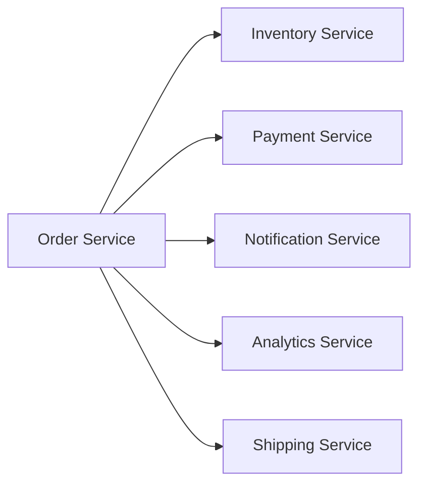
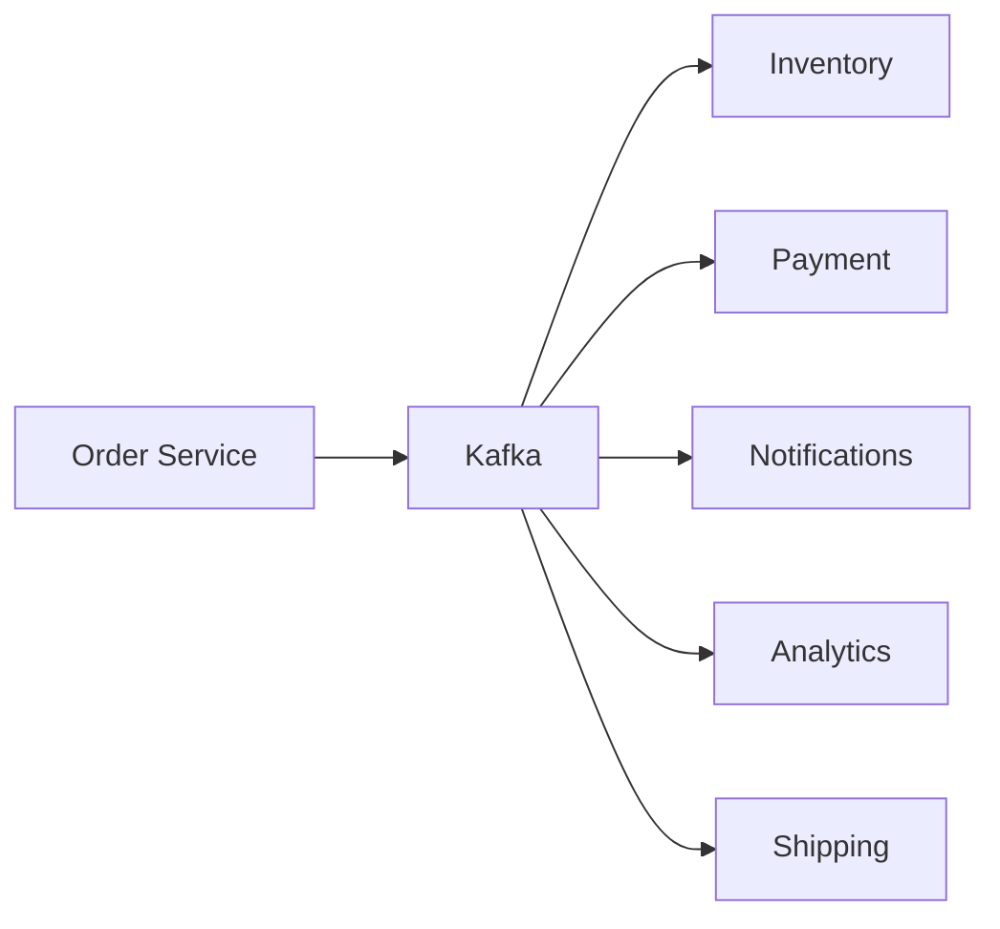

# Chapter 1: Why Kafka? The Problem It Solves

## Learning Objectives

By the end of this chapter, you'll understand:

- Real-world problems that Kafka solves
- When to use Kafka (and when NOT to)
- How Kafka fits into modern architectures
- Practical use cases you'll recognize

---

## The Problem: Traditional Systems Break at Scale

### Scenario 1: The E-Commerce Nightmare

Imagine you're building an online store. When a customer places an order:

**Problems with direct API calls:**

!!! danger "Pain Points"
    -  If one service is down, the whole order fails
    -  Slow services delay the entire flow
    -  Scaling is a nightmare (tight coupling)
    -  Adding new services requires changing code everywhere

---

## The Kafka Solution

Kafka acts as an **event backbone** — a central nervous system for your architecture.

**Benefits:**

!!! success "Kafka Advantages"
    -  **Decoupling:** Services don't know about each other
    -  **Resilience:** Failed services can catch up later
    -  **Scalability:** Add consumers without touching producers
    -  **Replay:** Reprocess events anytime (like a DVR for data)

---

## Real-World Use Cases

=== "E-Commerce"
    - Order processing pipelines
    - Inventory updates
    - Customer activity tracking

=== "Finance"
    - Real-time fraud detection
    - Payment processing
    - Transaction logging

=== "IoT"
    - Sensor data ingestion
    - Fleet monitoring
    - Predictive maintenance

=== "Social Media"
    - Activity feeds
    - Notifications
    - Recommendation engines

---

## When NOT to Use Kafka

!!! warning "Kafka Isn't Always the Answer"
    **Don't use Kafka if:**
    
    - You need request-response (use REST/gRPC)
    - You have < 100 events/day (overkill)
    - Your data must be < 1ms latency (Kafka is ~10ms+)
    - You need transactions across services (use orchestration/saga)

---

## Kafka vs Alternatives

| Feature | Kafka | RabbitMQ | AWS SNS/SQS | REST APIs |
|---------|-------|----------|-------------|-----------|
| **Throughput** | ⭐⭐⭐⭐⭐ | ⭐⭐⭐ | ⭐⭐⭐⭐ | ⭐⭐ |
| **Replay** | Yes | No | No | No |
| **Ordering** | Per Partition | Limited | No | Yes |
| **Complexity** | High | Medium | Low | Low | ---

## Key Takeaways

!!! tip "Remember"
    - Kafka is an **event streaming platform**, not just a message queue
    - It **decouples** systems and enables **event-driven architectures**
    - Best for **high-throughput**, **replay-able** event streams
    - Not a replacement for REST APIs or databases

---

!!! success "Next Step"
    Now that you know WHY Kafka, let's learn **[Core Concepts](02-core-concepts.md)** →

