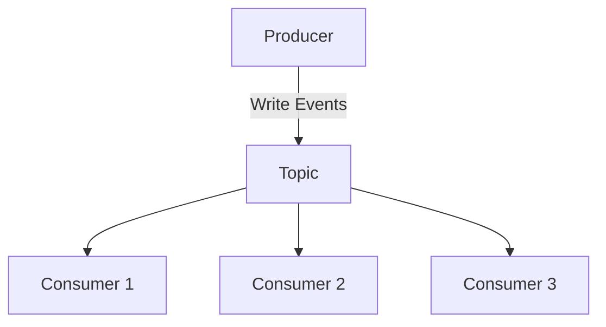
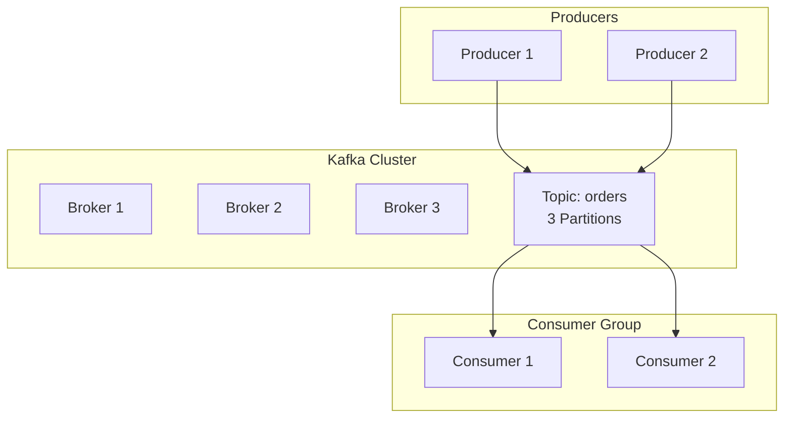

# Chapter 2: Core Concepts You Must Know

## Learning Objectives

Master the essential Kafka building blocks:

- Topics, Partitions, Offsets
- Producers and Consumers
- Brokers and Clusters
- Consumer Groups

---

## The Kafka Mental Model

Think of Kafka as a **distributed append-only log** system.



---

## Topics: Event Categories

A **topic** is like a folder or database table — it holds events of a specific type.

!!! example "Topic Examples"
    - `orders` — all order events
    - `user-signups` — registration events
    - `payment-transactions` — payment events

### Creating a Topic

```bash
kafka-topics --create --topic orders \
  --bootstrap-server localhost:9092 \
  --partitions 3 \
  --replication-factor 1
```

---

## Partitions: The Secret to Scale

Topics are split into **partitions** — parallel lanes for events.

```
Topic: orders
├── Partition 0: [msg0, msg3, msg6, ...]
├── Partition 1: [msg1, msg4, msg7, ...]
└── Partition 2: [msg2, msg5, msg8, ...]
```

!!! info "Why Partitions?"
    - **Parallelism:** Multiple consumers read simultaneously
    - **Ordering:** Guaranteed within a partition (not across partitions)
    - **Scalability:** Add partitions to increase throughput

---

## Offsets: Message IDs

Each message in a partition gets a unique **offset** (like an index).

```
Partition 0:
Offset 0: {"orderId": "123", "amount": 99.99}
Offset 1: {"orderId": "124", "amount": 149.99}
Offset 2: {"orderId": "125", "amount": 49.99}
```

Consumers track their position using offsets.

---

## Producers: Event Writers

Producers **publish events** to topics.

```python
from kafka import KafkaProducer
import json

producer = KafkaProducer(
    bootstrap_servers='localhost:9092',
    value_serializer=lambda v: json.dumps(v).encode('utf-8')
)

# Send an event
producer.send('orders', {'orderId': '123', 'amount': 99.99})
producer.flush()
```

### Producer Decisions

!!! question "Key Design Choices"
    1. **Which partition?** → Kafka decides (round-robin) or you specify a key
    2. **Guaranteed delivery?** → Configure `acks` (0, 1, or all)
    3. **Retry?** → Set `retries` and `retry.backoff.ms`

---

## Consumers: Event Readers

Consumers **subscribe to topics** and process events.

```python
from kafka import KafkaConsumer
import json

consumer = KafkaConsumer(
    'orders',
    bootstrap_servers='localhost:9092',
    value_deserializer=lambda m: json.loads(m.decode('utf-8')),
    group_id='order-processors'
)

for message in consumer:
    order = message.value
    print(f"Processing order: {order['orderId']}")
```

---

## Consumer Groups: Parallel Processing

Multiple consumers with the **same group ID** share the workload.

```
Topic: orders (3 partitions)
Consumer Group: order-processors

Consumer 1 → reads Partition 0
Consumer 2 → reads Partition 1
Consumer 3 → reads Partition 2
```

!!! success "Scaling Pattern"
    - Add more consumers (up to # of partitions) to increase throughput
    - Each consumer in a group processes different partitions
    - Different groups get **all messages** independently

---

## Brokers & Clusters

A **broker** is a Kafka server. A **cluster** is multiple brokers working together.

```
Cluster:
├── Broker 1 (leader for partition 0)
├── Broker 2 (leader for partition 1)
└── Broker 3 (leader for partition 2)
```

### Replication

Partitions are **replicated** across brokers for fault tolerance.

```
Partition 0:
  - Leader: Broker 1
  - Followers: Broker 2, Broker 3
```

If Broker 1 fails, Broker 2 becomes the new leader.

---

## Putting It All Together



---

## Key Takeaways

!!! tip "Remember"
    - **Topics** organize events by type
    - **Partitions** enable parallelism and ordering
    - **Offsets** track position in the log
    - **Producers** write events; **Consumers** read them
    - **Consumer Groups** enable scalable processing
    - **Brokers** store and serve data with replication

---

<div class="result" markdown>

!!! success "Next Step"
    Ready to get hands-on? Let's do a **[10-Minute Setup](03-setup.md)** →

</div>
