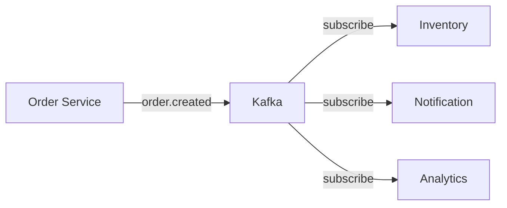

# Chapter 9: Design Patterns

## 🎯 Essential Kafka Design Patterns

Learn battle-tested patterns for building robust event-driven systems.

---

## 🔄 1. Event-Driven Microservices

Services communicate through events, not direct calls.



**Benefits:** Loose coupling, scalability, resilience

---

## 📢 2. Fan-Out Pattern

One event triggers multiple independent actions.

```
Order Created Event
    ├→ Send Email
    ├→ Update Inventory
    ├→ Process Payment
    └→ Log Analytics
```

**Use Case:** Order processing, user registration

---

## 📥 3. Fan-In Pattern

Multiple events aggregate into one stream.

```
User Clicks (Topic 1)
Page Views (Topic 2)     → Combined Analytics Stream
Purchases (Topic 3)
```

**Use Case:** Real-time dashboards, unified analytics

---

## ⚰️ 4. Dead Letter Queue (DLQ)

Failed messages go to a separate topic for later analysis.

```python
try:
    process_message(message)
except Exception as e:
    producer.send('orders-dlq', {
        'original_message': message,
        'error': str(e),
        'timestamp': time.time()
    })
```

**Use Case:** Error handling, debugging

---

## ⏮️ 5. Event Replay Pattern

Reprocess historical events (like rewinding a DVR).

```bash
# Reset consumer group to beginning
kafka-consumer-groups --bootstrap-server localhost:9092 \
  --group my-group \
  --reset-offsets --to-earliest \
  --topic orders --execute
```

**Use Cases:**
- Bug fixes (reprocess with corrected logic)
- New features (replay old events through new consumers)
- Data recovery

---

## 💬 6. Request-Reply with Kafka

Implement synchronous-style communication over Kafka.

```python
# Requester
correlation_id = str(uuid.uuid4())
producer.send('requests', {
    'correlation_id': correlation_id,
    'reply_topic': 'replies',
    'data': {...}
})

# Wait for reply
for msg in consumer:
    if msg.value['correlation_id'] == correlation_id:
        return msg.value['response']
```

**Use Case:** Service orchestration, legacy system integration

---

## 🎓 Pattern Selection Guide

| Pattern | Use When | Avoid When |
|---------|----------|------------|
| Event-Driven | Async workflows | Need immediate response |
| Fan-Out | Multiple downstream actions | Tightly coupled logic |
| Fan-In | Aggregate from many sources | Single source sufficient |
| DLQ | Transient failures expected | Errors are show-stoppers |
| Replay | Events are immutable | Data privacy concerns |

---

<div class="result" markdown>

!!! success "Next"
    Learn **[Anti-Patterns to Avoid](10-anti-patterns.md)** →

</div>
