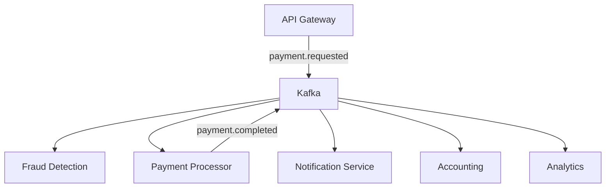
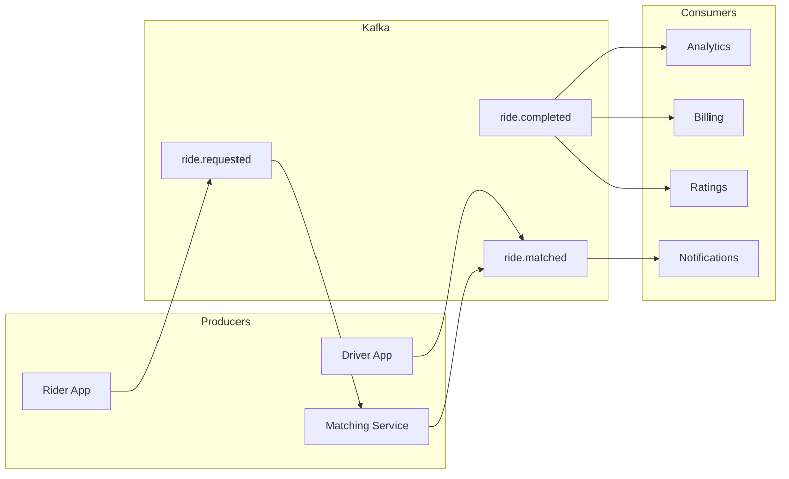
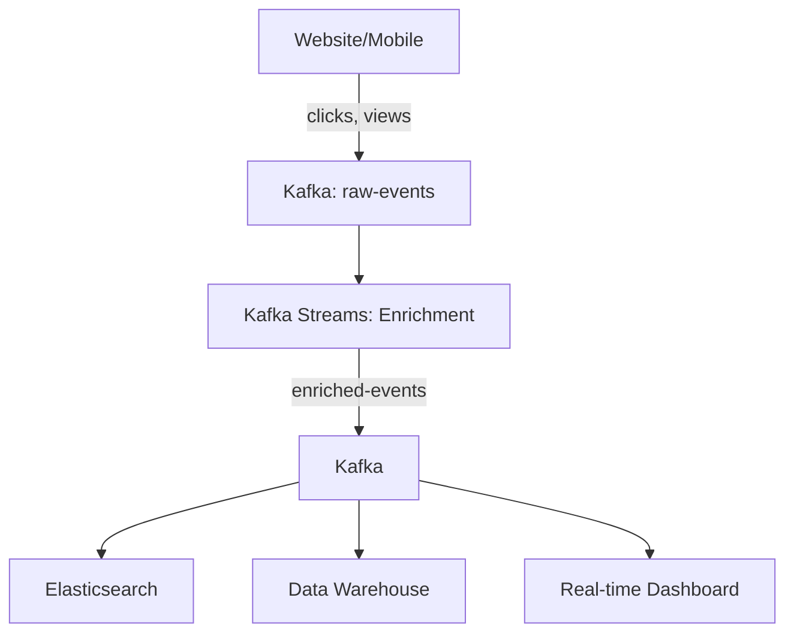
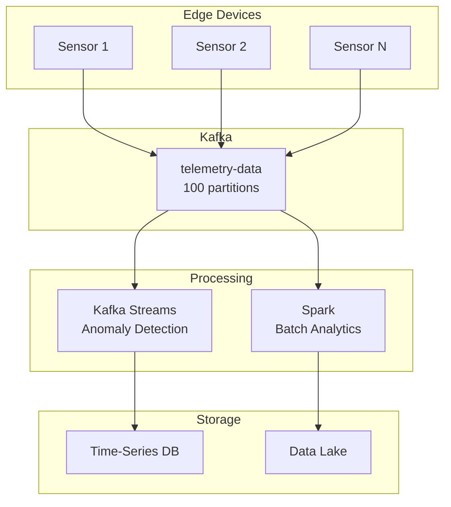
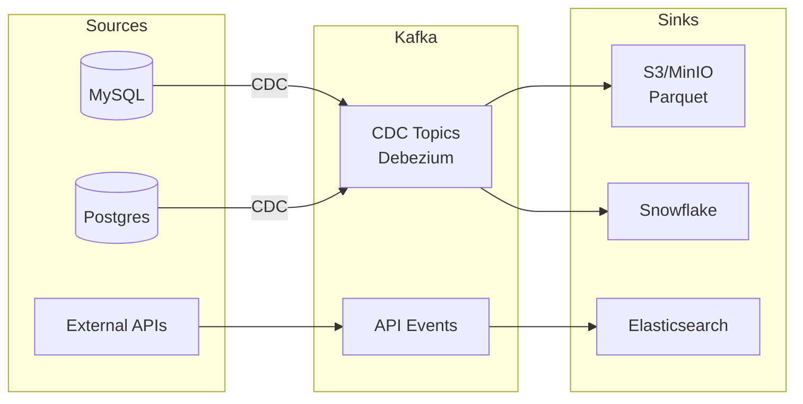

# Chapter 11: Real-World Architectures

## 🏗️ Production System Designs

Study battle-tested architectures from real companies.

---

## 💳 1. Payment Processing System

**Key Patterns:**
- Event-driven orchestration
- Idempotent processing (duplicate payments)
- Dead letter queues for failed payments

**Topics:**
- `payments.requested`
- `payments.validated`
- `payments.completed`
- `payments.failed`

---

## 🚗 2. Ride-Hailing Event Platform

**Scale Requirements:**
- 1M+ rides/day
- Sub-second matching latency
- Geographic partitioning

**Topics Strategy:**
- Partition by city/region (geo-locality)
- Separate topics for different stages

---

## 📊 3. Clickstream Analytics Platform

**Data Flow:**
1. **Ingest:** Millions of click events/sec
2. **Enrich:** Add user metadata, session data
3. **Route:** Different sinks for different use cases

**Partitioning:**
- By `user_id` (session analysis)
- By `session_id` (event ordering)

---

## 🏭 4. IoT Data Ingestion Pipeline

**Challenges:**
- High volume (10K+ devices × 1 msg/sec)
- Out-of-order delivery
- Device failures

**Solutions:**
- Windowed aggregations
- Compression
- Tiered storage

---

## 🏦 5. Data Lake Ingestion

**CDC (Change Data Capture) Pattern:**
- Captures every database change as event
- No impact on source databases
- Enables real-time data warehouse

---

## 📈 Architecture Decision Guide

| Requirement | Pattern | Example |
|-------------|---------|---------|
| **High throughput** | Many partitions, compression | Clickstream |
| **Strict ordering** | Single partition or keyed | Payments |
| **Geographic distribution** | Multi-cluster replication | Ride-hailing |
| **Complex processing** | Kafka Streams | Fraud detection |
| **Integration-heavy** | Kafka Connect | Data lake |

---

## 🎓 Key Takeaways

!!! tip "Lessons from Production"
    1. **Start simple, scale as needed**
    2. **Monitor everything** (lag, throughput, errors)
    3. **Design for failure** (retries, DLQs, idempotence)
    4. **Use the right tool** (Kafka for streaming, DB for storage)
    5. **Test at scale** (chaos engineering)

---

!!! success "Part III Complete!"
    Learn **[Production Deployment](../part-4/index.md)** next →

