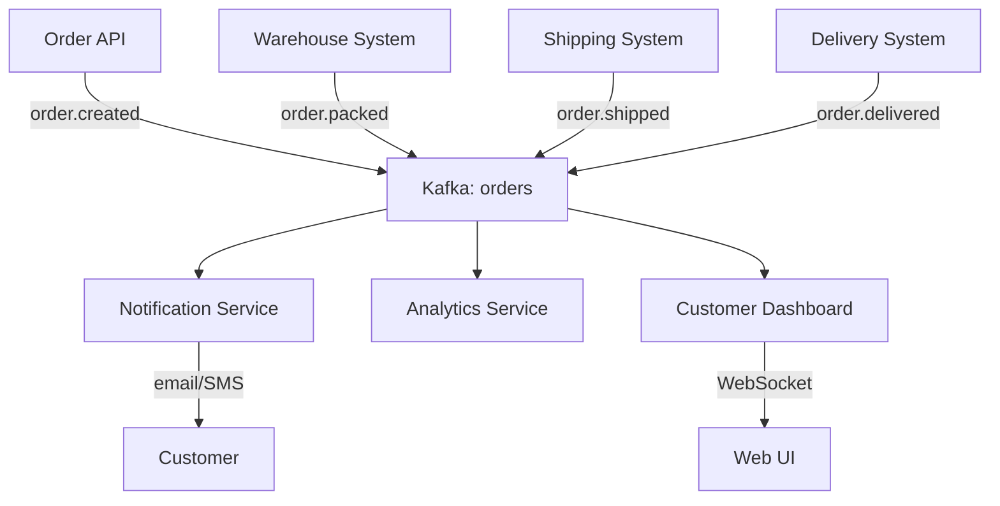

# Project 1: Real-time Order Tracking System

## Project Overview

Build an end-to-end order tracking system where customers can see real-time updates as their orders move through different stages.

**Duration:** 2-3 hours  
**Difficulty:** ⭐⭐ (Beginner)

---

## Architecture



---

## What You'll Learn

- [x] Topic design for event-driven workflows
- [x] Producer implementation (multiple services)
- [x] Consumer groups for parallel processing
- [x] Event ordering within partitions
- [x] Docker Compose for local development

---

## Tech Stack

- **Backend:** Python (FastAPI) or Java (Spring Boot)
- **Kafka:** Docker Compose
- **Frontend:** React (optional)
- **Database:** PostgreSQL

---

## Step 1: Design Events

### Order Event Schema

```json
{
  "event_id": "uuid",
  "event_type": "order.created | order.packed | order.shipped | order.delivered",
  "timestamp": "2025-12-06T10:30:00Z",
  "order_id": "ORD-12345",
  "customer_id": "CUST-789",
  "data": {
    "status": "created",
    "location": "warehouse-01",
    "estimated_delivery": "2025-12-08",
    "items": [...]
  }
}
```

### Topic Strategy

```
Topic: orders
Partitions: 3
Partition Key: order_id (ensures all events for an order go to same partition)
Retention: 7 days
```

---

## Step 2: Setup Infrastructure

### Docker Compose

```yaml
version: '3.8'
services:
  zookeeper:
    image: confluentinc/cp-zookeeper:7.5.0
    environment:
      ZOOKEEPER_CLIENT_PORT: 2181

  kafka:
    image: confluentinc/cp-kafka:7.5.0
    depends_on:
      - zookeeper
    ports:
      - "9092:9092"
    environment:
      KAFKA_BROKER_ID: 1
      KAFKA_ZOOKEEPER_CONNECT: zookeeper:2181
      KAFKA_ADVERTISED_LISTENERS: PLAINTEXT://localhost:9092
      KAFKA_OFFSETS_TOPIC_REPLICATION_FACTOR: 1

  postgres:
    image: postgres:15
    environment:
      POSTGRES_PASSWORD: postgres
    ports:
      - "5432:5432"
```

**Start:**
```bash
docker-compose up -d
```

---

## Step 3: Build Producers

### Order API (order_service.py)

```python
from kafka import KafkaProducer
from fastapi import FastAPI
import json
import uuid
from datetime import datetime

app = FastAPI()

producer = KafkaProducer(
    bootstrap_servers='localhost:9092',
    key_serializer=lambda k: k.encode('utf-8'),
    value_serializer=lambda v: json.dumps(v).encode('utf-8')
)

@app.post("/orders")
def create_order(order_data: dict):
    order_id = f"ORD-{uuid.uuid4().hex[:8]}"
    
    event = {
        "event_id": str(uuid.uuid4()),
        "event_type": "order.created",
        "timestamp": datetime.utcnow().isoformat(),
        "order_id": order_id,
        "customer_id": order_data['customer_id'],
        "data": {
            "status": "created",
            "items": order_data['items'],
            "total": order_data['total']
        }
    }
    
    # Key by order_id for ordering
    producer.send('orders', key=order_id, value=event)
    producer.flush()
    
    return {"order_id": order_id, "status": "created"}

if __name__ == "__main__":
    import uvicorn
    uvicorn.run(app, host="0.0.0.0", port=8000)
```

### Warehouse Service (warehouse_service.py)

```python
import time
import random

def simulate_warehouse():
    """Simulates packing orders"""
    consumer = KafkaConsumer(
        'orders',
        bootstrap_servers='localhost:9092',
        group_id='warehouse',
        value_deserializer=lambda m: json.loads(m.decode())
    )
    
    for message in consumer:
        event = message.value
        
        if event['event_type'] == 'order.created':
            # Simulate packing delay
            time.sleep(random.uniform(2, 5))
            
            packed_event = {
                "event_id": str(uuid.uuid4()),
                "event_type": "order.packed",
                "timestamp": datetime.utcnow().isoformat(),
                "order_id": event['order_id'],
                "customer_id": event['customer_id'],
                "data": {"status": "packed", "location": "warehouse-01"}
            }
            
            producer.send('orders', key=event['order_id'], value=packed_event)
            print(f" Packed: {event['order_id']}")
```

---

## Step 4: Build Consumers

### Notification Service

```python
def notification_service():
    """Sends notifications for order updates"""
    consumer = KafkaConsumer(
        'orders',
        bootstrap_servers='localhost:9092',
        group_id='notifications',
        value_deserializer=lambda m: json.loads(m.decode())
    )
    
    for message in consumer:
        event = message.value
        customer_id = event['customer_id']
        status = event['event_type'].split('.')[1]
        
        # Send notification (email/SMS)
        print(f" Notifying {customer_id}: Order {event['order_id']} is {status}")
        
        # In real app: send_email() or send_sms()
```

### Analytics Service

```python
def analytics_service():
    """Track order metrics"""
    consumer = KafkaConsumer(
        'orders',
        bootstrap_servers='localhost:9092',
        group_id='analytics',
        value_deserializer=lambda m: json.loads(m.decode())
    )
    
    stats = {
        'created': 0,
        'packed': 0,
        'shipped': 0,
        'delivered': 0
    }
    
    for message in consumer:
        event = message.value
        status = event['event_type'].split('.')[1]
        stats[status] += 1
        
        print(f" Stats: {stats}")
```

---

## Step 5: Test the System

### Test Script

```python
import requests
import time

# Create 10 orders
for i in range(10):
    response = requests.post('http://localhost:8000/orders', json={
        'customer_id': f'CUST-{i}',
        'items': [{'sku': 'ITEM-1', 'qty': 2}],
        'total': 99.99
    })
    print(f"Created: {response.json()}")
    time.sleep(1)
```

### Run All Services

```bash
# Terminal 1: Start Kafka
docker-compose up

# Terminal 2: Order API
python order_service.py

# Terminal 3: Warehouse simulator
python warehouse_service.py

# Terminal 4: Notification consumer
python notification_service.py

# Terminal 5: Analytics consumer
python analytics_service.py

# Terminal 6: Create orders
python test_orders.py
```

---

## Success Criteria

- [ ] Orders created via API
- [ ] Events published to Kafka
- [ ] Warehouse picks up and packs orders
- [ ] Notifications sent for each status change
- [ ] Analytics tracks order counts
- [ ] All events for same order in same partition

---

## Extensions

1. **Add Web UI** — Real-time dashboard with WebSocket
2. **Add Shipping/Delivery** — Complete the workflow
3. **Add Error Handling** — Dead letter queue for failures
4. **Add Persistence** — Store order state in PostgreSQL
5. **Add Monitoring** — Prometheus metrics

---

## Complete Code

[Download full project →](https://github.com/dwdas9/learnkafka/tree/main/projects/order-tracking)

---

<div class="result" markdown>

!!! success "Next Project"
    Build **[Project 2: Inventory Sync](project-2-inventory-sync.md)** →

</div>
