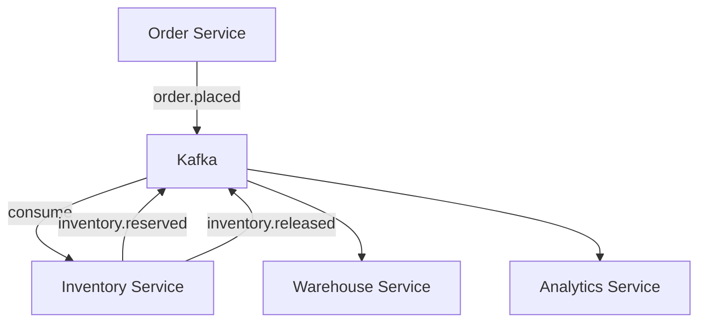

# Project 2: Inventory Sync Across Microservices

## 🎯 Project Overview

Build an event-driven inventory management system where multiple microservices stay in sync through Kafka events.

**Duration:** 3-4 hours  
**Difficulty:** ⭐⭐⭐☆☆ (Intermediate)

---

## 🏗️ Architecture

---

## 📋 What You'll Learn

- Event-driven choreography
- Saga pattern for distributed transactions
- Compensating transactions
- Event sourcing basics
- Idempotent consumers

---

## 💻 Implementation

### Events

- `inventory.reserve-requested`
- `inventory.reserved`
- `inventory.insufficient`
- `inventory.released`

### Services

1. **Order Service** — Initiates reservations
2. **Inventory Service** — Manages stock levels
3. **Warehouse Service** — Physical fulfillment
4. **Compensation Service** — Handles rollbacks

---

## 🎯 Challenges

- Handle concurrent reservations
- Implement idempotency (same request twice)
- Compensating actions on failures

---

*[Full implementation details to be added]*

---

!!! success "Next Project"
    Build **[Project 3: Fraud Analytics](project-3-fraud-analytics.md)** →

