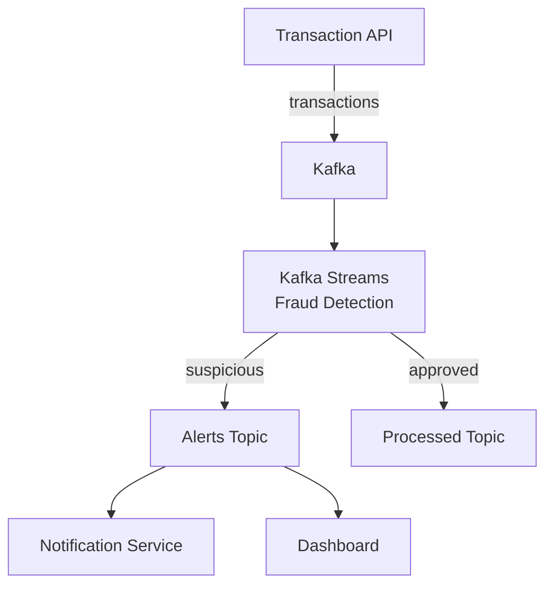

# Project 3: Fraud Detection Analytics Pipeline

## Project Overview

Build a real-time fraud detection system using Kafka Streams with windowing and pattern matching.

**Duration:** 4-5 hours  
**Difficulty:** ⭐⭐⭐⭐ (Advanced)

---

## Architecture



---

## What You'll Learn

- Kafka Streams fundamentals
- Windowing (tumbling, hopping, session)
- Stateful processing (aggregations)
- Pattern detection
- Real-time alerts

---

## Fraud Rules

1. **Velocity Check:** > 5 transactions in 10 minutes
2. **Amount Check:** Transaction > $10,000
3. **Location Change:** Different countries within 1 hour
4. **Pattern Matching:** Repeated small amounts (structuring)

---

## Kafka Streams Implementation

```java
KStream<String, Transaction> transactions = builder.stream("transactions");

// Rule 1: Velocity check
KTable<Windowed<String>, Long> txnCount = transactions
    .groupByKey()
    .windowedBy(TimeWindows.of(Duration.ofMinutes(10)))
    .count();

KStream<Windowed<String>, Long> suspicious = txnCount
    .toStream()
    .filter((key, count) -> count > 5);

suspicious.to("fraud-alerts");
```

---

*[Full implementation with all rules to be added]*

---

<div class="result" markdown>

!!! success "Next Project"
    Build **[Project 4: ETL Pipeline](project-4-etl-pipeline.md)** →

</div>
