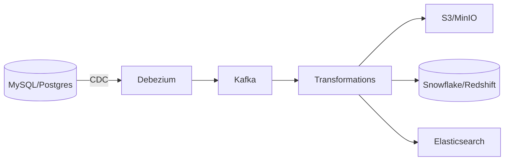

# Project 4: ETL Pipeline to Data Warehouse

## Project Overview

Build a CDC-based ETL pipeline using Kafka Connect to stream database changes to a data warehouse.

**Duration:** 3-4 hours  
**Difficulty:** ⭐⭐⭐ (Intermediate)

---

## Architecture



---

## What You'll Learn

- Change Data Capture (CDC)
- Debezium configuration
- Kafka Connect setup
- Data transformations
- Multiple sink connectors

---

## Components

### 1. Source: Debezium (MySQL CDC)

```json
{
  "name": "mysql-source",
  "config": {
    "connector.class": "io.debezium.connector.mysql.MySqlConnector",
    "database.hostname": "mysql",
    "database.port": "3306",
    "database.user": "debezium",
    "database.password": "dbz",
    "database.server.id": "184054",
    "database.server.name": "mysql",
    "database.include.list": "inventory",
    "database.history.kafka.bootstrap.servers": "kafka:9092",
    "database.history.kafka.topic": "schema-changes"
  }
}
```

### 2. Sink: S3

```json
{
  "name": "s3-sink",
  "config": {
    "connector.class": "io.confluent.connect.s3.S3SinkConnector",
    "topics": "mysql.inventory.orders",
    "s3.bucket.name": "data-lake",
    "format.class": "io.confluent.connect.s3.format.parquet.ParquetFormat"
  }
}
```

---

## Pipeline Flow

1. Database changes captured by Debezium
2. CDC events published to Kafka
3. Transformations applied (e.g., flatten nested JSON)
4. Data routed to multiple sinks (S3, Snowflake, ES)

---

*[Full implementation with docker-compose to be added]*

---

<div class="result" markdown>

!!! success "Next Project"
    Build **[Project 5: Clickstream Analytics](project-5-clickstream.md)** →

</div>
