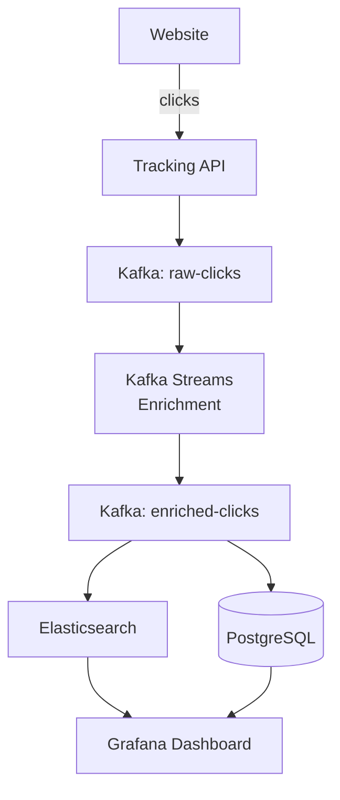

# Project 5: Clickstream Analytics Dashboard

## 🎯 Project Overview

Build an end-to-end clickstream analytics pipeline from web tracking to real-time dashboard.

**Duration:** 4-5 hours  
**Difficulty:** ⭐⭐⭐⭐⭐ (Advanced)

---

## 🏗️ Architecture



---

## 📋 What You'll Learn

- High-volume event ingestion
- Stream enrichment (joining streams)
- Sessionization (window aggregation)
- Multiple data sinks
- Real-time visualization

---

## 📊 Metrics to Track

1. **Page Views** — Total and per page
2. **Unique Users** — Daily/hourly active users
3. **Session Duration** — Average time on site
4. **Conversion Funnel** — Homepage → Product → Checkout
5. **Popular Pages** — Top 10 pages
6. **Real-time Traffic** — Current users online

---

## 💻 Implementation Highlights

### Click Event Schema

```json
{
  "event_id": "uuid",
  "timestamp": "2025-12-06T10:30:00Z",
  "user_id": "anon-12345",
  "session_id": "sess-abc",
  "page": "/products/item-123",
  "referrer": "https://google.com",
  "user_agent": "Mozilla/5.0...",
  "ip": "203.0.113.1"
}
```

### Kafka Streams: Sessionization

```java
KStream<String, ClickEvent> clicks = builder.stream("raw-clicks");

// Session windows (10 min gap)
KTable<Windowed<String>, Long> sessions = clicks
    .groupByKey()
    .windowedBy(SessionWindows.with(Duration.ofMinutes(10)))
    .count();
```

### Grafana Dashboard

*[Screenshot of real-time dashboard to be added]*

---

## 🎯 Success Criteria

- [ ] Ingest 1000+ clicks/sec
- [ ] Real-time dashboard updates
- [ ] Session tracking with windowing
- [ ] Conversion funnel analysis
- [ ] Historical data in warehouse

---

*[Full implementation with code and dashboard config to be added]*

---

<div class="result" markdown>

!!! success "Course Complete!"
    Congratulations! Review **[Resources](../resources/cheat-sheets.md)** →

</div>
